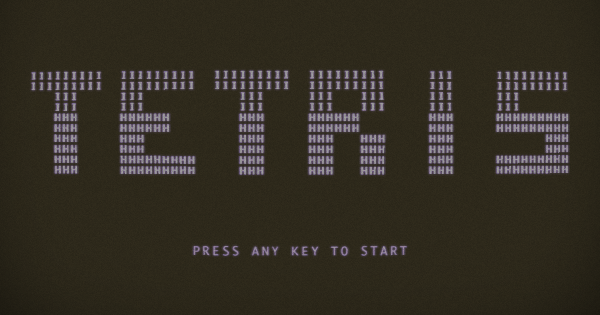
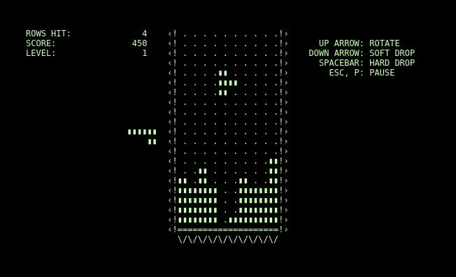
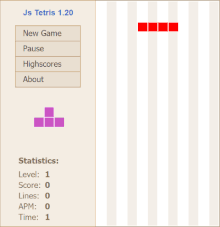
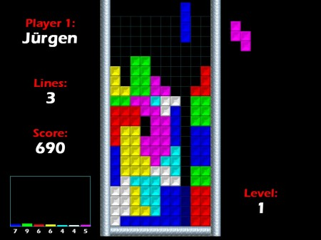

# [Play Tetris](https://mrgpalo.github.io/Tetris/)

## Tabla de contenidos
---

1. Descripción
	1. Motivacion
1. Instrucciones de instalación


## Descripción
---

Basado en el juego original "Tetris", creado en 1984 por Alexkséi Pázhitnov.



Esta versión estará basada en la edición de Windows 2000, que cuenta con colores, una velocidad por defecto de caída, caída directa a fondo, el nombre del jugador, las líneas terminadas, la puntuación total, la siguiente pieza que caerá y el nivel en el que nos encontramos. El contador de puntos por colores lo dejaré para el final, a modo de bonus.

### Motivación

Tetris fue un juego que jugué mucho cuando era pequeño, y he querido hacer uno por mi mismo con los conocimientos adquiridos en este bootcamp.

## Intrucciones de instalación en local
---

Primero tendremos que clonar el repositorio

```console
 git clone https://github.com/MrGPalo/Tetris.git
 cd Tetris
 yarn install
 yarn run start
```
## Dependencias
---

| Nombre | Enlace | Descripción |
| :----: | :----: | :----: |
| Yarn | http://yarnpkg.com/ | Gestor de paquetes |
| Typescript | http://typescriptlang.org/ | Lenguaje de tipado |
| Parcel | http://parcel.org/ | Empaquetador de aplicaciones web |
| Eslint | http://eslint.org/ | Guía de estilos |

## Controles
---

ArrowUp: Rotar la pieza


ArrowLeft: Mover la pieza a la izquierda

ArrowRight: Mover la pieza a la derecha

Space: Bajar la pieza hasta el fondo



## Objetivo

Si todo va como espero, el resultado final debería parecerse a algo como esto.



